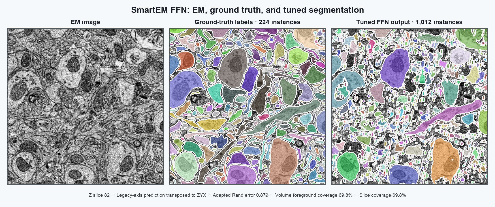

# Running FFN on Docker

This Dockerfile is based on the [JHU/APL fork](https://github.com/aplbrain/ffn) of Google's flood-filling networks segmentation algorithm.

The supplied configuration uses a Karlupia mouse-EM checkpoint and inference
parameters tuned against the labeled SmartEM example. The included reference
output was generated with the same configuration.

## Requirements
* Hardware or cloud resources with one or more Nvidia GPUs
* Docker
* A working directory
* An aligned EM image volume. 
  * FFN expects a 3D H5 file
  * In `example_working_dir/meirovitch2025`, we provide a pre-downloaded test volume
  * We also provide a script `download_training_data.py` for downloading a precomputed volume and converting to the correct format

## Setup
1. Ensure that Nvidia drivers are installed on the machine so that the GPU can be used. If nothing is printed from the following command, you will need to install the appropriate drivers for your OS.
```
nvidia-smi
```

2. Install `nvidia-container-toolkit`. Installation guide can be found on [Nvidia's website](https://docs.nvidia.com/datacenter/cloud-native/container-toolkit/latest/install-guide.html).

3. Run the following commands to expose the GPU to Docker:
```
nvidia-ctk runtime configure --runtime=docker
systemctl restart docker
```

4. Build the Docker image from source.
```
docker build -t ffn:latest .
```

5. Copy images and the checkpoint to a working directory. The example includes
   canonical image/label volumes and the legacy-axis uint8 input used by the
   tuned model. Place the checkpoint shards at
   `example_working_dir/meirovitch2025/ffn_model/model.ckpt-2500000*`.

## Training
Coming soon

## Inference
1. Use `inference_config_example.pbtxt`. It is configured for the included
   `image_volume_legacy.h5` and checkpoint location. The important tuned values
   are an odd `[17, 17, 9]` FOV, movement threshold `0.90`, segment threshold
   `0.40`, disconnectedness threshold `-1`, and minimum segment size `250`.

    More examples are found in the [ffn configs directory](https://github.com/aplbrain/ffn/tree/master/configs) and guidance is found in the [ffn docs](https://github.com/aplbrain/ffn/blob/master/doc/manual.md#segmentation-inference).

2. From the repository root, run inference over the complete example volume.
   The legacy input has array shape `700x700x94`, so its valid FFN XYZ bounding
   box is `94x700x700`.

```bash
docker run --rm \
  --gpus all \
  -v "$PWD/example_working_dir:/example_working_dir" \
  ffn:latest \
  python run_inference.py \
    --inference_request="$(cat tools/ffn/inference_config_example.pbtxt)" \
    --bounding_box='start { x:0 y:0 z:0 } size { x:94 y:700 z:700 }'
```

The result is written to
`example_working_dir/meirovitch2025/ffn_results/0/0/seg-0_0_0.npz`.
The supplied result is in legacy XYZ array order; the evaluator and viewer
transpose it back to canonical ZYX.

## Evaluation

The label HDF5 stores instance IDs as three uint8 color channels. The evaluator
packs these channels into IDs, ignores zero-valued ground truth, and calculates
adapted Rand error/precision/recall, VI split/merge, foreground coverage, and
covered-only variants. From the repository root, run:

```bash
uv run python tools/ffn/evaluate_smartem.py \
  'example_working_dir/meirovitch2025/ffn_results/**/seg-*.npz' \
  --prediction-axes=2,1,0 \
  --setting=axis-legacy_move-0.90_seg-0.40_disco--1_min-250 \
  --csv=example_working_dir/meirovitch2025/ffn_results/metrics.csv
```

The included tuned result has adapted Rand error `0.87875`, foreground
coverage `0.69843`, VI split `1.91335`, and VI merge `3.51740`.



The comparison uses slice 82, whose `69.8%` foreground coverage closely
matches the full-volume coverage. White outlines mark instance boundaries;
zero-valued unlabeled regions remain transparent over the EM image.

## Visualization

Use the provided notebook `view_data.ipynb` to inspect the result:

```bash
uv sync
uv run --with jupyter jupyter lab
```
Then open the notebook, and for the kernel, use "Existing Jupyter Server" with the URL that was printed in the terminal. It should be formatted as http://localhost:8888/lab?token=<token>.
